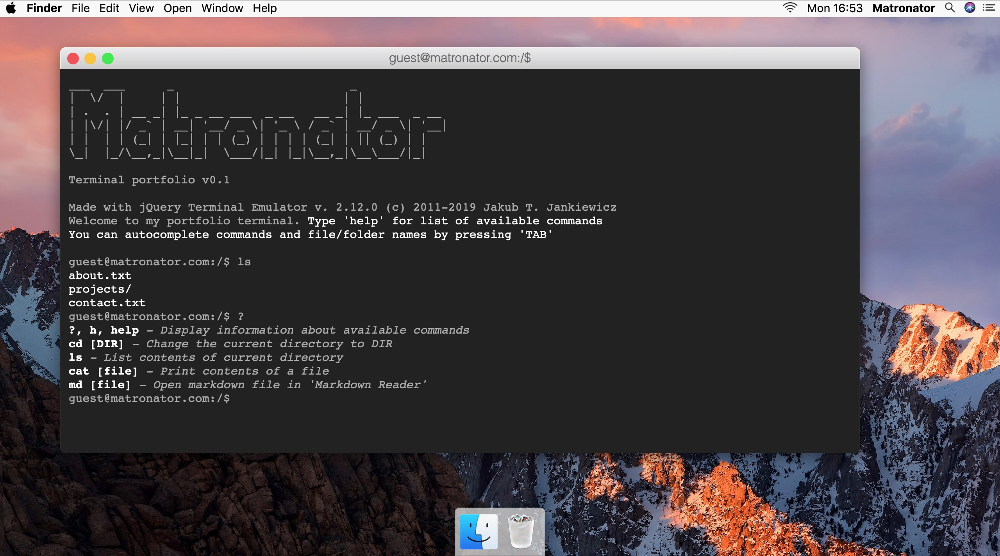

# Matronator macOS Portfolio

### Portfolio with terminal 

#### (Work in progress)

Visit here: https://matronator.github.io/matronator-macos-portfolio/

My portfolio (https://matronator.com), but via terminal and styled to look like macOS. Made with [jQuery Terminal Emulator.](http://terminal.jcubic.pl)

## Credits

* Terminal: [jcubic / jquery.terminal](https://github.com/jcubic/jquery.terminal)
* Markdown to HTML: [showdownjs / showdown](https://github.com/showdownjs/showdown)
